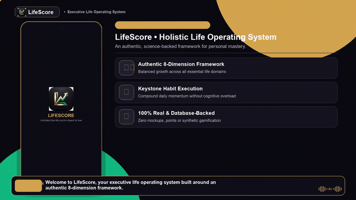
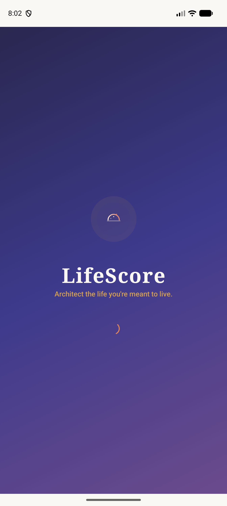
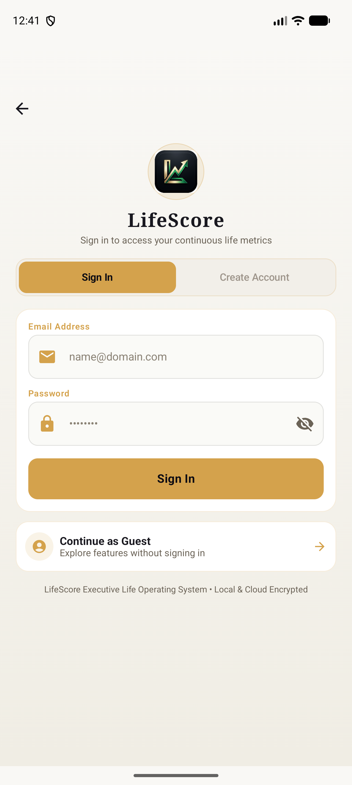
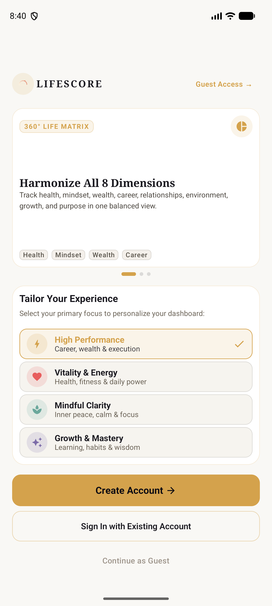
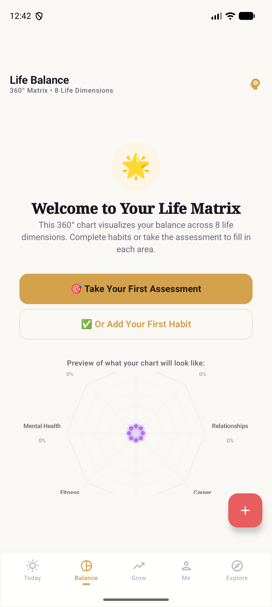
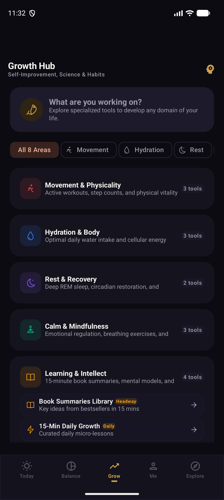
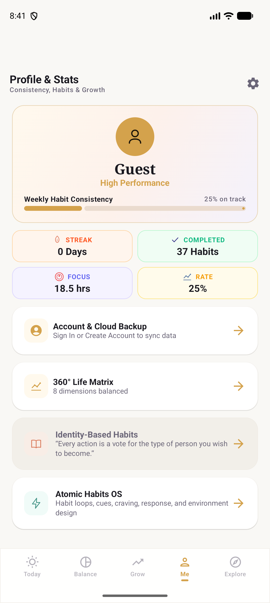

# LifeScore

[](https://kotlinlang.org)
[](https://developer.android.com/jetpack/compose)
[](https://m3.material.io)
[](https://developer.android.com/topic/architecture)
[](https://developer.android.com/training/data-storage/room)
[](https://opensource.org/licenses/MIT)

LifeScore is a modern executive life operating system and personal growth Android application. Designed with an Obsidian Dark and Champagne Gold editorial aesthetic, LifeScore empowers users to harmonize eight foundational life dimensions through habit loops, focus protocols, and 360-degree life balance analytics.

---

## Demo

Experience how LifeScore transforms daily intentionality, multi-dimensional life balance, and deep focus through real reactive data and intelligent coaching.

<p align="center">
  <video src="https://github.com/snaimio/lifescore-android-app/releases/download/v1.0.0/lifescore_walkthrough_demo.mp4" controls="controls" width="850" style="max-width: 100%; border-radius: 12px; box-shadow: 0 8px 30px rgba(0,0,0,0.5);">
    <a href="https://github.com/snaimio/lifescore-android-app/releases/download/v1.0.0/lifescore_walkthrough_demo.mp4">
      
    </a>
  </video>
</p>

<p align="center">
  <a href="https://github.com/snaimio/lifescore-android-app/releases/download/v1.0.0/lifescore_walkthrough_demo.mp4">
    <strong>▶ Watch & Download Full Video Demo with Audio (MP4)</strong>
  </a>
</p>

---

## Visual Showcase

| Onboarding & Welcome | Account Creation | Today Dashboard |
| :---: | :---: | :---: |
|  |  |  |

| 360° Life Matrix | Growth Hub | Profile & Live Stats |
| :---: | :---: | :---: |
|  |  |  |

---

## Key Capabilities

### 1. Executive Life Dashboard & Daily Command
- **LifeScore Index Hero**: Multi-stop gradient gauge reflecting real-time calculated life balance and current streaks.
- **Keystone Focus**: Dedicated daily keystone tracker to prioritize high-leverage execution.
- **Card-Based Habit Grid**: Structured daily habits with single-tap completion, dynamic progress tracking, and category tags.

### 2. 360° Life Matrix & Multi-Dimensional Analytics
- Real-time radar visualization measuring balance across eight core dimensions:
  - **Health & Vitality**
  - **Mindset & Clarity**
  - **Wealth & Capital**
  - **Career & Purpose**
  - **Relationships & Connection**
  - **Physical Environment**
  - **Growth & Intellect**
  - **Spirit & Resilience**

### 3. Growth Hub & Performance Protocols
- **Deep Work Focus Timer**: Integrated Pomodoro and custom deep-work focus sessions.
- **Mindfulness & Meditation**: Guided breathwork and serenity bell audio sessions.
- **Curated Micro-Lessons**: 15-minute key insights and mental models from essential nonfiction literature.
- **Atomic Habits System**: Habit loops, environment design, and identity-based behavior architecture.

### 4. Authentication, Guest Mode & Cloud Sync
- **Frictionless Guest Access**: Immediate full-feature exploration without forced registration barriers.
- **Dedicated Account Suite**: Seamless account creation and sign-in with full encryption.
- **Continuous Cloud Sync**: Upgrade guest sessions to cloud-backed Firebase Firestore accounts with zero data loss.

### 5. True Reactive Data (Zero Mock Placeholders)
- 100% live Room database queries powered by Kotlin Flows (`combine(getUserProfile(), getAllTasks())`).
- Real metrics for task completion counts, consistency rates, active streak records, and focus hours.

---

## Architecture & Technology Stack

```
app/
├── core/
│   ├── designsystem/     # Bespoke Obsidian & Champagne Gold M3 tokens, GlassCard, typography
│   └── util/             # LeagueManager, ArchetypeManager, time calculation helpers
├── data/
│   ├── local/            # Room Database (AppDatabase), DAOs, Entities, TypeConverters
│   ├── remote/           # Firebase Auth, Cloud Firestore, Remote Data Mappers
│   └── repository/       # Unified offline-first repository implementations
├── domain/
│   └── model/            # Immutable domain models (UserProfile, TaskItem, LifeDimension)
└── presentation/
    ├── navigation/       # LifeScoreNavGraph, LifeScoreBottomBar, LifeScoreDrawer
    ├── theme/            # Material 3 theme configurations
    └── ui/
        ├── auth/         # LoginScreen, RegisterScreen, AuthViewModel
        ├── balance/      # BalanceScreen (Radar Chart, Dimension Details)
        ├── explore/      # ExploreScreen, Directory, Tools
        ├── grow/         # GrowthHub, FocusTimer, Meditation, MicroLessons
        ├── home/         # TodayScreen, KeystoneFocus, LifeScoreHero
        ├── me/           # MeScreen, Cloud Backup, Settings, Live Stats
        └── onboarding/   # WelcomeScreen, Archetype Discovery
```

### Core Libraries
- **Language**: Kotlin 2.0.21
- **UI Framework**: Jetpack Compose (BOM 2024.10.01) with Material 3
- **Local Persistence**: Room 2.6.1 (SQLite with KSP code generation)
- **Asynchronous Stream**: Kotlin Coroutines & StateFlow
- **Backend & Cloud**: Firebase Authentication, Cloud Firestore, Firebase Crashlytics
- **Intelligence**: Google Gemini API client integration
- **Widgets & Backgrounding**: Jetpack Glance Widgets, AndroidX WorkManager

---

## Getting Started

### Prerequisites
- Android Studio Ladybug (2024.2.1) or later
- JDK 17 or JDK 21
- Android SDK 34+ (Android 14 / 15)

### Setup
1. Clone this repository:
   ```bash
   git clone https://github.com/snaimio/lifescore-android-app.git
   ```
2. Open the project in Android Studio.
3. Place your `google-services.json` inside the `app/` root directory.
4. (Optional) Add your Gemini API key in `local.properties`:
   ```properties
   GEMINI_API_KEY=your_gemini_api_key_here
   ```
5. Sync Gradle and launch on an Android physical device or emulator.

---

## Build & Test Commands

```bash
# Run all unit tests
./gradlew testDebugUnitTest

# Build debug APK
./gradlew assembleDebug

# Install on connected device
./gradlew installDebug

# Build release bundle
./gradlew bundleRelease
```

---

## License

This project is licensed under the MIT License. See [LICENSE](LICENSE) for details.

---

## Author

**Sheikh Naim**
