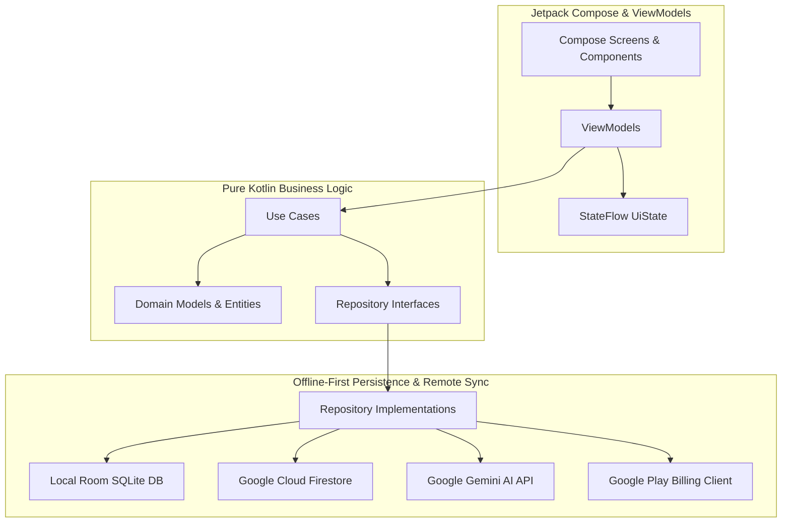

# ⚡ LifeScore - Gamified Self-Improvement Platform

        

> **Turn your life into an epic RPG.** LifeScore unifies your health, wealth, career, learning, and mindfulness into a single real-time **Human Vitality Index (0–1000)** powered by contextual Gemini AI coaching, 130-question psychometric archetypes, 10,000-hour deliberate skill tracking, and enterprise team duels.

---

## 🎯 Overview

Most self-improvement applications are fragmented—fitness apps track workouts, budget apps track expenses, and meditation apps track minutes. **LifeScore solves fragmentation by unifying all 8 dimensions of human vitality into one gamified operating system.**

Every workout crushed, book read, deep work session logged, and meditation completed directly awards **XP**, boosts your **LifeScore**, grows your **Streak**, and earns **LifeScore Coins** to redeem for real-world custom rewards.

---

## ✨ Features Breakdown

### 🌟 Core Gamification & Vitality
* **8 Life Dimensions Spider Radar:** Real-time visual wheel spanning *Fitness, Health, Career, Wealth, Learning, Mental Health, Relationships, and Social Life*.
* **Unified LifeScore (0–1000):** Weighted algorithmic composite score reflecting overall human vitality and dimensional balance.
* **Multi-Format Habit Quests:** Boolean checkmarks, counter progress (e.g., 8/8 glasses of water), and multi-step sub-task routines.
* **Streak Safeguards & Insurance:** Active streak flames, consumable **Streak Shields**, and mentor-gifted **Guardian Sponsorships**.

### 🤖 Gemini AI Coach with Long-Term Memory
* **Contextual Memory Engine:** Remembers behavioral history (*"User struggles with morning hydration after late work nights"*).
* **Daily Executive Directives:** Actionable morning orders and proactive habit adjustments.
* **Executive Weekly Performance Audits:** Automatic Sunday recap of strongest dimensions, growth bottlenecks, and dimensional recap cards.

### 🧬 Psychometrics & Hero Archetypes
* **130-Question Assessment:** 5-point Likert psychometric evaluation mapping Big Five personality traits.
* **10 Hero Archetypes:** Unlocks *The Architect, The Warrior, The Sage, The Visionary, The Healer, The Sovereign, The Alchemist, and more*.
* **48 RIASEC Career Trajectory Matches:** Scientific alignment between psychological traits and real-world career paths.

### ⏱️ 10,000-Hour Skill Mastery Tracker
* **Deliberate Practice Stopwatch:** Interactive circular timer ring logging practice hours.
* **6 Ascending Mastery Tiers:** *Novice (0h) ➡️ Apprentice (100h) ➡️ Practitioner (500h) ➡️ Expert (2,000h) ➡️ Master (5,000h) ➡️ Outlier Legend (10,000h)*.

### 🪙 Reward Store & Economy
* **Coin Ledger System:** Earn coins via daily quests, 30-day challenges, and league promotions.
* **Custom Real-World Rewards:** Create user-defined dopamine rewards (*"Watch 1 episode of Netflix after 5 tasks (500 🪙)"*).
* **Digital Cosmetics:** Premium themes, avatar frames, and streak boosters.

### 🎭 AI Meme Studio & Social Duels
* **8 Viral Meme Formats:** 9:16 story cards (*"The Dimension Gap"*, *"3 AM Empire Architect"*, *"Sigma Streak"*).
* **🎲 AI Caption Remixer:** Generates personalized captions using your highest/lowest dimension scores.
* **1v1 7-Day Social Duels:** Compete with friends with daily proof check-ins and Diamond League promotions.
* **60-Second Daily Micro-Vlogs:** CameraX video stitching for habit milestone montages.

### 🏢 LifeScore Enterprise (B2B)
* **Team Roster & Roles:** Multi-department structure (*Engineering, Product, Sales, Operations*) with Admin, Lead, and Member tiers.
* **Company-Wide Quests:** 1,000,000 Step challenges, Q3 deep work sprints, and circadian resets.
* **Executive Burnout Radar:** Proactive burnout risk detection and department vitality analytics.
* **B2B Billing Calculator:** Startup, Growth, and Enterprise tier seat calculators with PDF/CSV export.

---

## 📱 Tech Stack Matrix

| Layer | Technologies |
|---|---|
| **Language** | Kotlin 1.9.20 (100% Coroutines & Flow) |
| **UI Toolkit** | Jetpack Compose + Material Design 3 |
| **Architecture** | Clean Architecture (Domain, Data, Presentation) + MVVM |
| **Dependency Injection** | Application-Scoped Container (Lazy Singleton DI) |
| **Local Persistence** | AndroidX Room (SQLite) with TypeConverters |
| **Cloud Synchronization** | Google Cloud Firestore + Firebase Authentication (Offline-First) |
| **AI / LLM** | Google Gemini Generative AI SDK (Flash 1.5) |
| **Media & Camera** | AndroidX CameraX (Private Application Sandboxed Storage) |
| **In-App Purchases** | Google Play In-App Billing 7.0 (Subscription Management) |
| **Localization** | 5 Languages: English 🇺🇸, Spanish 🇪🇸, Chinese 🇨🇳, Arabic 🇸🇦 (RTL), Hindi 🇮🇳 |
| **Testing** | JUnit 4, Kotlinx Coroutines Test (31 Test Suites, 100% Passing) |
| **Build & Release** | Gradle 8.2 (KSP, Proguard/R8 Minification, Signed App Bundle `.aab`) |

---

## 🏗️ Architecture Overview



---

## 🚀 Getting Started

### Prerequisites
* **Android Studio**: Android Studio Hedgehog (2023.1.1) or later
* **JDK**: OpenJDK 17 or higher
* **Android SDK**: Compile SDK 34, Min SDK 26

### Clone & Build
```bash
# 1. Clone the repository
git clone https://github.com/snaimio/lifescore-android-app.git

# 2. Enter project directory
cd lifescore-android-app

# 3. Build debug APK
./gradlew assembleDebug

# 4. Run all 31 automated test suites
./gradlew test

# 5. Generate production signed Release App Bundle (.aab)
./gradlew bundleRelease
```

---

## 🧪 Automated Test Suite (31 Suites Passing)

```log
✓ ConsentManagerTest (GDPR JSON Export Schema & Consent Logic)
✓ MemeGeneratorEngineTest (8 Viral Formats, AI Caption Remixing, Share Formatter)
✓ UseCasesTest (CalculateScore, GetTasks, CompleteTask, DeleteTask, Profile, AI Advice)
✓ EnterpriseEngineTest (Vitality Index, Department Derby, Burnout Radar, B2B Billing)
✓ LocalizationEngineTest (5 Languages, RTL Arabic, 10 Localized Archetypes)
✓ RewardStoreEngineTest (Store Catalogs, Coin Ledger, Custom Redemption)
✓ AdvancedHabitEngineTest (Counter Habits, Sub-task Routines, Auto-Suggestions)
✓ SkillMasteryEngineTest (10,000-Hour Math, Tier Boundaries, Practice Stopwatch)
✓ ExpertChallengeEngineTest (Masterclasses, Day Check-ins, Verified Certificates)
✓ AiMemoryEngineTest (Long-term Context Prompting, Behavioral Reflections)
✓ DailyVlogStitcherTest (60s Montage Stitching, 12-Member Groups)
✓ ArchetypeSystemTest (130-Question Scoring, 10 Archetype Mapping)
✓ PsychometricAssessmentEngineTest (Big Five Trait Normalization, 48 RIASEC Matches)
✓ MicroHabitEngineTest (30-Day Chains, Atomic Habit XP Attribution)
✓ GooglePlayBillingTest (Subscription Sku Entitlements, Annual Savings)
✓ AiCoachServiceTest (Deterministic Advice & Executive Audits)
✓ StreakInsuranceAndGuardianTest (Shield Consumptions, Guardian Sponsorships)
✓ SocialDuelEngineTest (1v1 Matchmaking, Check-in Proof Feeds)
✓ LeaderboardEngineTest (League Tiers, Promotion/Relegation Thresholds)
✓ FirestoreLiveIntegrationTest (Live CRUD & SetOptions.merge Sync)
✓ DataSyncArchitectureTest (Offline SQLite to Online Cloud Firestore Sync)
```

---

## ⚖️ Legal & Privacy Compliance

* 🛡️ **Privacy Policy**: [https://lifescore-app-2d99e.web.app/privacy](https://lifescore-app-2d99e.web.app/privacy)
* 📑 **Terms of Service**: [https://lifescore-app-2d99e.web.app/terms](https://lifescore-app-2d99e.web.app/terms)
* 🔒 **GDPR & CCPA Compliant**: 1-Tap machine-readable JSON data export and permanent cloud data erasure in Settings.

---

## 📄 License
Distributed under the **MIT License**. See [`LICENSE`](./LICENSE) for full details.

&copy; 2026 LifeScore Technologies Inc. Built with ❤️ for human vitality.
