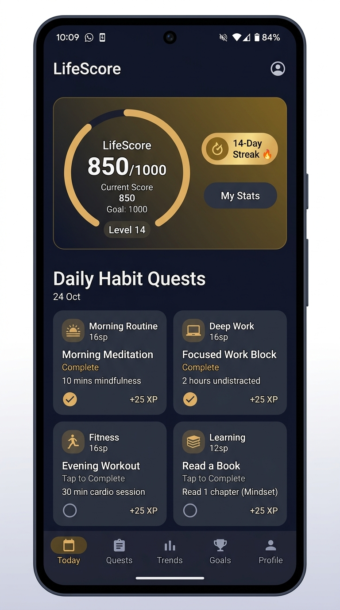
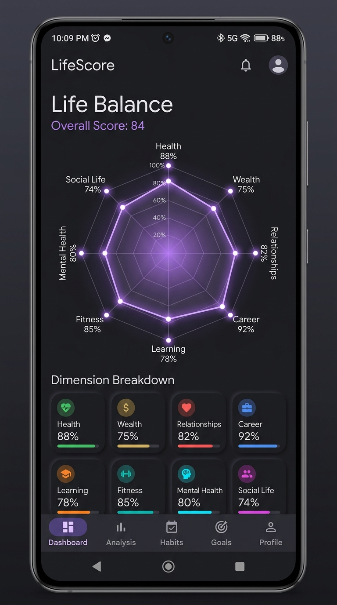
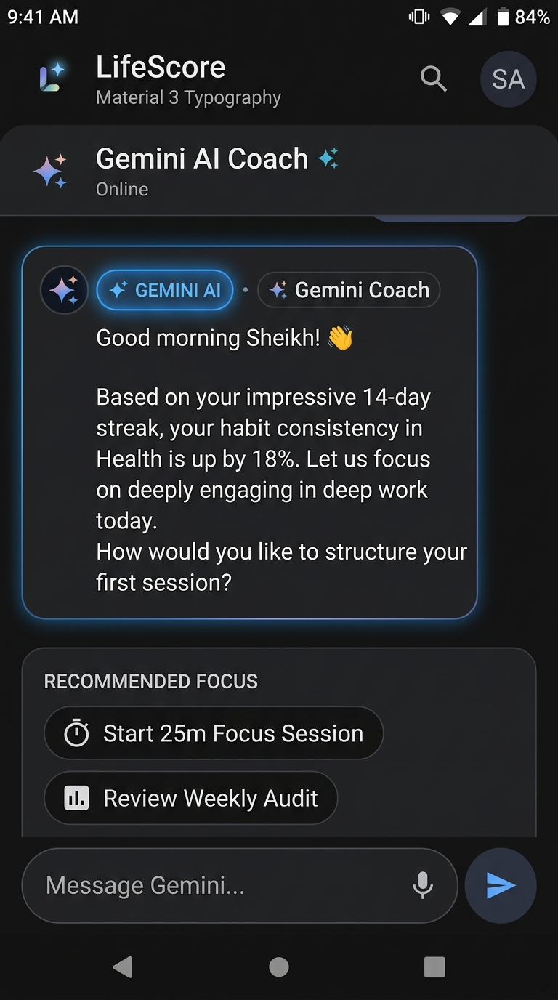
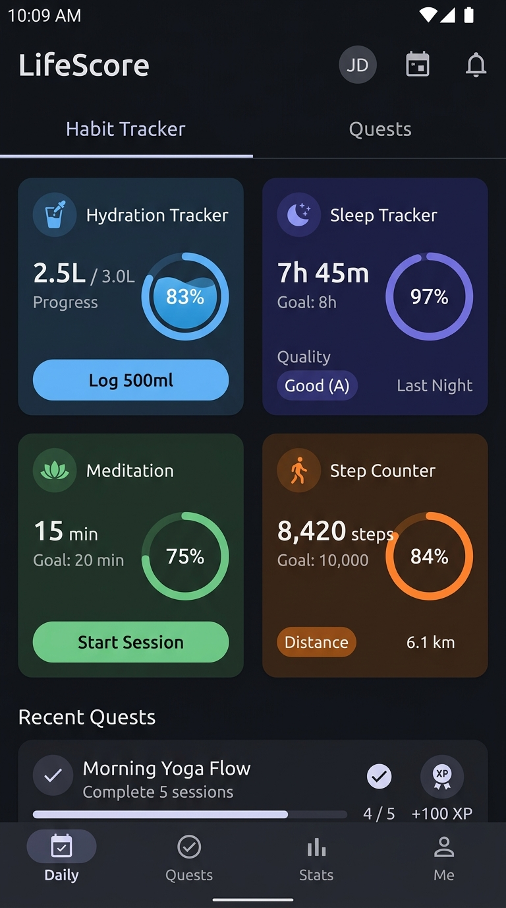

# LifeScore

A personal growth Android app that helps users track habits and balance across eight life dimensions: Health, Wealth, Relationships, Career, Learning, Fitness, Mental Health, and Social Life.

Built with Kotlin and Jetpack Compose as a capstone project.

## Features

- 10-question personality assessment with archetype reveal
- Eight-dimension life balance tracker with radar chart
- Daily habit tracking with streaks
- AI coach powered by Gemini
- Fifteen life trackers (hydration, sleep, focus, mood, meditation, and more)
- Offline-first architecture with Room and Firebase Firestore
- Google, email, and anonymous sign-in
- Home screen widget and notifications
- Material 3 theming with light and dark mode
- GDPR and CCPA compliant privacy controls

## Tech Stack

- Kotlin
- Jetpack Compose with Material 3
- Clean architecture with MVVM
- Room for local persistence
- Firebase Auth, Firestore, Analytics, Crashlytics
- Gemini API for AI features
- Google Play Billing
- WorkManager for background tasks
- Coroutines and Flow

## Requirements

- Android Studio Ladybug or later
- JDK 17
- Android SDK 34
- A Firebase project with Firestore and Authentication enabled
- A Gemini API key

## Setup

1. Clone the repository.
2. Add your google-services.json to the app directory.
3. Add your Gemini API key to local.properties as GEMINI_API_KEY.
4. Sync Gradle and run the app on a device or emulator.

## Build

Debug build:

    ./gradlew assembleDebug

Release bundle:

    ./gradlew bundleRelease

## Testing

Run unit tests:

    ./gradlew testDebugUnitTest

## Screenshots

| Today | Balance | AI Coach | Habits |
| :---: | :---: | :---: | :---: |
|  |  |  |  |

## License

MIT License. See LICENSE for details.

## Author

Sheikh Naim
